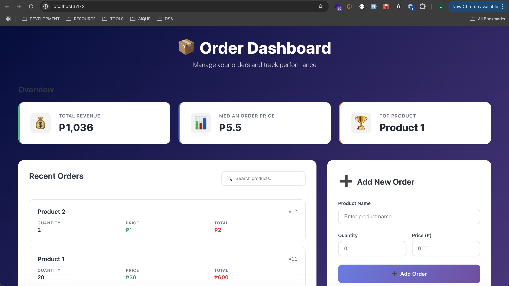

# 📦 BarBooks Frontend

BarBooks Frontend is a modern and clean React + TypeScript application designed to manage orders efficiently. It features order creation, live summary tracking, pagination, and filtering — all built with maintainable, component-based architecture.



---

## ✨ Features

- ✅ **Create Orders** – Add product orders with quantity and price inputs.
- 📊 **Live Summary Panel** – Shows total revenue, median order price, and top product.
- 🔍 **Search Filtering** – Filter orders by product name in real-time.
- 📄 **Pagination** – Browse orders with dynamic pagination (10 per page).
- ♻️ **Automatic Refresh** – Summary and order list update after adding an order.
- 📱 **Responsive Design** – Mobile-friendly layout with professional UI/UX.

---

## 🔧 Tech Stack

- **React** (Functional + Hooks)
- **TypeScript**
- **Custom Hooks** for data fetching (e.g., `useSummary`, `useGetOrders`)
- **Fetch API** for backend communication
- **CSS Modules** or scoped `.css` for styling
- ⚙️ **Connected to Express + SQLite Backend**

---

## 🚀 Getting Started

### 1. Clone the Repository

```bash
git clone https://github.com/your-username/barbooks-frontend.git
cd barbooks-frontend


2. Install Dependencies
bash
Copy
Edit
npm install


3. Start the Development Server
bash
Copy
Edit
npm run dev
```
